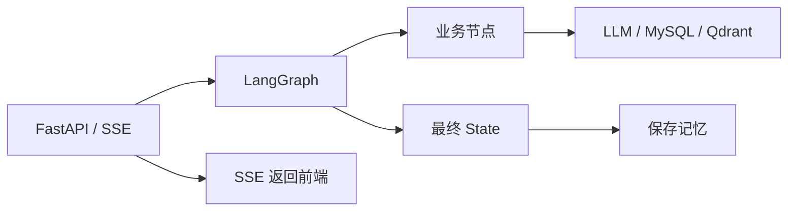
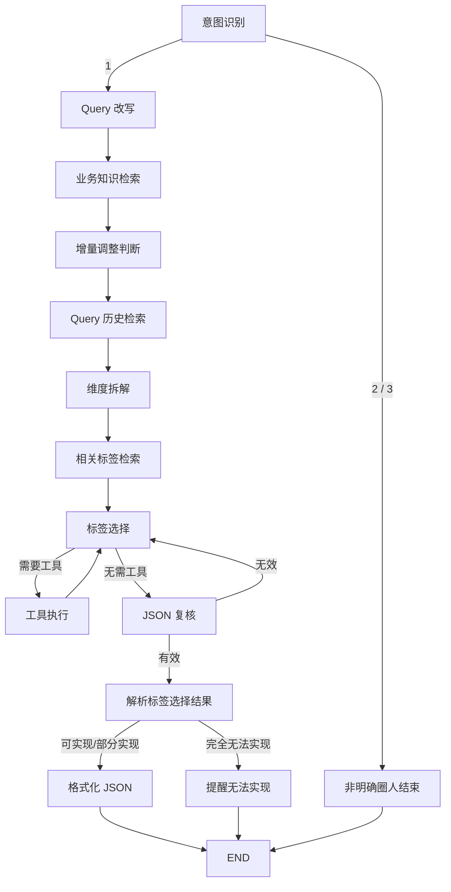

# 第 4 课：追踪 `es-ai master` 完整调用链

## 本课目标

- 分清 API 层、Graph 层、节点层和存储层。
- 追踪一个请求如何形成初始 State。
- 说清每个节点读取和写入哪些字段。
- 理解 Graph 结束不等于一次 API 请求结束。
- 找出失败被空结果或默认值掩盖的位置。

## 1. 本章使用的请求

```json
{
  "query": "帮我圈选上海30岁以上的女性用户",
  "session_id": "study-session-001",
  "user_id": "study-user-001",
  "customer_name": "伊利"
}
```

为了专注主流程，先假设：

- 这是首轮对话，没有历史记忆。
- 意图识别结果为明确圈人需求 `"1"`。
- 不需要调用日期等工具。
- 标签选择输出合法 JSON。
- `label_select_output_type == 0`，需求可以实现。

## 2. 先划分四层



### API 层

主要文件：

```text
/Users/sumengzhang/Desktop/projects/es-ai/Audience_Copilot/api/agent_server.py
```

职责：

- 接收 HTTP 请求。
- 生成或读取 Session/User ID。
- 创建 SSE 队列和 Snapshot。
- 计算当前轮次。
- 构造 `initial_state`。
- 调用 `agent_app.invoke()`。
- 将节点事件推送给前端。
- Graph 完成后保存会话记忆。

### Graph 层

主要文件：

```text
/Users/sumengzhang/Desktop/projects/es-ai/Audience_Copilot/agent/graph.py
```

职责：注册 Node、Edge、Router 和循环，决定流程顺序。

### 节点层

职责：调用模型、检索数据、解析结果，返回 Partial State。

### 外部资源层

- LLM：意图识别、Query 改写、维度拆解、标签选择。
- MySQL：标签元数据。
- Qdrant/LlamaIndex：业务知识、历史 Query 和会话记忆。

## 3. Graph 运行前发生什么

API 层先查询历史记忆数量，计算：

```python
turn_number = len(existing_memories) + 1
```

然后构造初始 State：

```python
{
    "user_query": "帮我圈选上海30岁以上的女性用户",
    "session_id": "study-session-001",
    "user_id": "study-user-001",
    "collection_name": "study_user_001_study_session_001",
    "turn_number": 1,
    "customer_name": "伊利",
    "enable_similarity_filter": True,
    "similarity_threshold": 0.5,
    "callbacks": [sse_callback],
}
```

注意：HTTP 请求体不是直接传给 Graph，API 层先把它转换成内部 State。

## 4. Graph 内主路径



## 5. 主路径 State 演进

### 意图识别

读取：

- `user_query`
- `session_id`
- `user_id`

写入：

- `intention_answer`
- `intention_recognition_extra_info`
- `collection_name`

Router 根据 `intention_answer` 决定继续或提前结束。

### Query 改写

读取用户输入和最近历史；首轮没有历史时不调用改写模型。

写入：

- `original_query`
- `rewritten_query`
- `turn_number`

### 业务知识检索

使用 `rewritten_query` 检索业务术语和解释。

写入：

- `business_knowledge`
- `business_knowledge_raw`

### 增量调整判断

读取当前 Query 和上一轮标签选择结果，判断是否为“再加上、去掉、改成”等操作。

写入：

- `is_adjustment`
- `previous_label_selection`
- `adjustment_instruction`
- `adjustment_type`

### Query 历史检索

使用稠密向量和 BM25 检索语义相近的历史请求。

写入：

- `query_history`
- `query_history_scores`
- `relative_label_select_result`

### 维度拆解

将自然语言需求拆成地域、年龄、性别等维度，并预测可能的标签名称。

写入：

- `dimensions`
- `dimension_values`
- `dimension_analysis`
- `predict_candidate_label`

### 相关标签检索

先从 MySQL 获取客户标签，再进行向量和精确取值匹配。

写入：

- `qa_label_metadata`
- `label_retrieval_stats`

### 标签选择

读取 Query、业务知识、维度、候选标签和历史结果，调用 LLM 生成标签条件。

无工具调用时写入：

- `label_select_answer`
- `label_select_thought`
- `needs_tool = False`

有工具调用时写入 `messages`、`tool_calls`、`needs_tool = True`，Router 转到工具执行。

### JSON 复核

检查标签选择结果能否解析，以及必需字段是否存在。

写入：

- `json_valid`
- `needs_regenerate`
- 可能更新 `label_select_answer`

无效时回到标签选择，形成第二个循环。

### 解析标签选择结果

提取：

- `label_select_output_type`
- `label_select_deficiency_reason`
- `audience_name`

### 格式化 JSON

将模型产生的中间结构转换成 QuickAudience 接口结构。

写入最终业务输出：

- `interface_json`

## 6. Graph 到 END 后还发生什么

`invoke()` 返回最终 State 后，API 层仍需：

1. 将最终字段同步到 SSE Snapshot。
2. 推送 `done` 事件。
3. 将本轮 Query、意图、维度、标签选择结果和 `interface_json` 写入记忆库。
4. 关闭本次 Snapshot。

当前 Graph 使用：

```python
app = graph.compile()
```

没有传入 Checkpointer，因此跨请求记忆不是 LangGraph 自动保存的，而是 API 层显式写入 Qdrant/LlamaIndex。

## 7. 两种“历史”不要混淆

### 最近会话历史

Query 改写和增量判断关心最近几轮发生了什么。

### 相似 Query 历史

Query 历史检索关心以前是否有语义相似的圈人请求及标签结果。

前者偏连续对话，后者偏案例复用；虽然都来自记忆库，但用途不同。

## 8. 阅读时需要发现的风险

项目中存在多种静默兜底：

- 意图 JSON 解析失败后猜测第一个字符，再将未知值当作非圈人。
- Query 改写失败后继续使用原始 Query。
- 业务知识检索失败后返回空知识继续执行。
- 标签数据库失败后返回空标签继续执行。
- 工具失败后把错误字符串作为工具结果交还模型。
- 历史标签 JSON 解析失败后跳过记录。

这类处理会让 Graph 顺利到达 `END`，但业务结果未必可信。重要认识是：

```text
流程成功结束 ≠ 业务成功
```

## 本课完成标准

完成配套工作表，并能回答：

1. 哪些操作发生在 Graph 外？
2. 初始 State 是谁构造的？
3. 哪个节点首次生成最终业务 DSL？
4. 为什么 `END` 后还要保存记忆？
5. 两个循环分别解决什么问题？
6. 哪些兜底会产生“假成功”？
