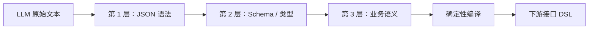

# 第 5 课：结构化输出与 JSON / DSL 校验

## 本课目标

- 理解“模型输出了 JSON”为什么不代表结果可执行。
- 分清 JSON 语法、Schema、业务语义三层校验。
- 使用 Pydantic 定义模型与程序之间的严格协议。
- 理解为什么最终接口 DSL 应由程序编译，而不是让模型自由拼接。

## 1. `es-ai` 中的问题位于哪里

`es-ai master` 的标签选择节点让模型返回类似下面的结果：

```json
{
  "label_select_output_type": 0,
  "label_select_deficiency_reason": "",
  "audience_name": "上海高龄女性",
  "result": {
    "groups": []
  },
  "conditionGroupsExpression": "((A1))"
}
```

相关代码：

- `Audience_Copilot/prompts/agent_prompt.py`：告诉模型应该输出什么。
- `Audience_Copilot/nodes/operation/agent_operation_node.py`：解析并转换结果。
- `Audience_Copilot/tests/test_integrate.py`：测试转换逻辑。

Prompt 只是要求，不是保证。即使模型返回的文本可以被 `json.loads()` 解析，仍可能出现：

- 少字段或多字段。
- `label_type` 本应是整数，却返回字符串 `"2"`。
- 使用标签库中不存在的 `label_id`。
- 数值标签却使用枚举操作符。
- 表达式引用 `A2`，但 `groups` 中只有 `A1`。
- 输出类型说“完全无法实现”，同时又返回了可执行条件。

## 2. 三层校验



### 第 1 层：JSON 语法

只回答：这段文本是不是一个合法 JSON？

```python
payload = json.loads(raw_text)
```

它不能判断标签是否存在，也不能判断字段含义是否正确。

### 第 2 层：Schema 与类型

回答：字段、嵌套结构和数据类型是否符合协议？

```python
class Rule(BaseModel):
    model_config = ConfigDict(extra="forbid", strict=True)

    label_id: str
    label_type: Literal[0, 1, 2, 4]
    operator: str
    values: list[str | int | float]
```

本章使用两个重要选项：

- `extra="forbid"`：遇到协议外字段直接失败。
- `strict=True`：不把字符串 `"2"` 自动转换为整数 `2`。

### 第 3 层：业务语义

Pydantic 不知道公司的标签库，因此还需要显式业务校验：

- 标签 ID 必须存在于标签目录。
- 标签名称、类型必须与目录一致。
- 操作符必须适合标签类型。
- 数值标签只能接收数值。
- 表达式引用的分组必须与实际分组完全一致。
- `output_type` 必须与结果内容一致：type=0 无缺失原因，type=1/2 必须说明原因，type=2 没有条件组。

## 3. Schema 校验和业务校验为什么要分开

两者的变化原因不同：

- Schema 是模型和程序之间的通信协议。
- 业务语义来自标签库、租户配置和业务规则。

例如 `operator: str` 在类型上完全合法，但年龄标签能否使用 `IN`，要由标签目录决定。把两层分开后，错误也更容易定位：到底是模型格式错了，还是模型选错了业务条件。

## 4. 为什么不应该“尽量修复”模型输出

下面这些做法会掩盖真实问题：

- 从 ```json 代码块中用正则截取一段 JSON。
- 缺字段时自动填默认值。
- 将 `"30"` 静默转换为数字 `30`。
- 遇到不存在的标签时换成一个相似标签。
- 表达式错误时默认只使用第一个分组。

这些行为会让错误数据进入圈人接口。更安全的策略是返回稳定错误码，并保留 `trace_id` 便于定位，然后由上层决定重试、让模型修正或提示用户。

## 5. 模型输出“计划”，程序编译 DSL

推荐边界：

```text
自然语言
  -> LLM 生成受约束的 LabelSelection
  -> 程序完成三层校验
  -> 程序确定性编译为 conditionGroups DSL
  -> 调用圈人接口
```

模型适合做语义判断，程序适合做精确映射。最终 DSL 中的字段改名、固定值和表达式结构，应由普通代码生成，这样同一输入一定产生同一输出，也更容易单元测试。

## 6. 本章示例的运行方式

```bash
cd /Users/sumengzhang/Desktop/projects/agent_study
uv run python agent/exercises/05_structured_output/demo.py
uv run python -m unittest agent.exercises.05_structured_output.test_demo -v
```

重点阅读顺序：

1. `Rule`、`ConditionGroup`、`LabelSelection`：看协议如何定义。
2. `parse_model_output()`：看语法和 Schema 错误如何分层。
3. `validate_business_rules()`：看程序如何验证业务事实。
4. `compile_interface_dsl()`：看校验后的计划如何确定性转换。

## 7. 读完后应该能回答

1. `json.loads()`、Pydantic、业务校验分别解决什么问题？
2. 为什么 `strict=True` 对模型输出很重要？
3. 为什么 Prompt 中写了“只能使用真实标签”，程序仍必须再次校验？
4. 为什么让模型直接生成最终接口 DSL 风险更高？
5. 校验失败后，应该在哪一层决定是否重试模型？

答案提示：校验函数只负责判定成功或失败；是否重试属于 Graph 的流程控制，不应藏在校验函数内部。
